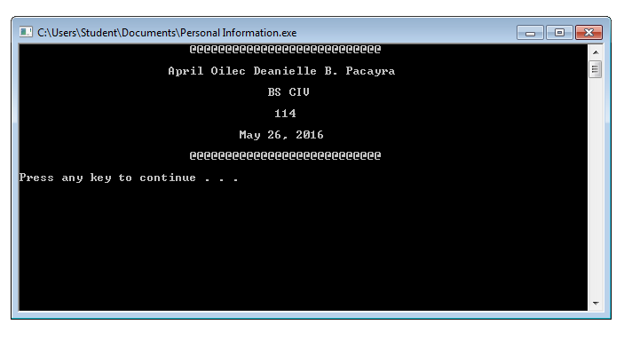
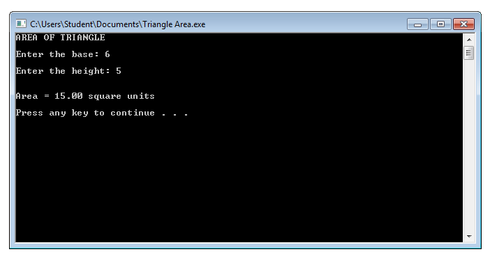
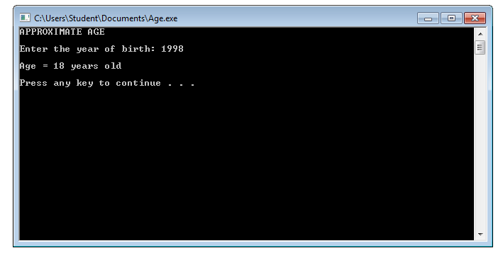
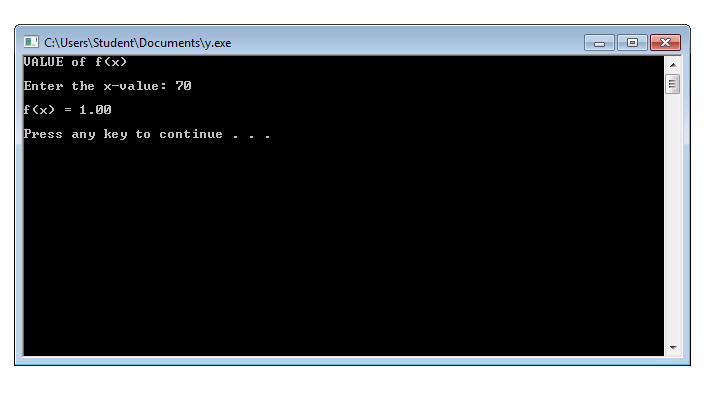

# Activity1-PacayraAOD

```
#include <stdio.h>
#include <stdlib.h>

int main()
{
	int a;
	
	printf("\t\t\t");
	for (a=1;a<28;a++)
	printf("@");
	printf("\n\n\t\t     April Oilec Deanielle B. Pacayra\n");
	printf("\n\t\t\t\t   BS CIV\n");
	printf("\n\t\t\t\t    114\n");
	printf("\n\t\t\t       May 26, 2016\n\n");
	
	printf("\t\t\t");
	for (a=1;a<28;a++)
	printf("@");
	printf("\n\n");
	
	system("PAUSE");
	return 0;
}
```



```
#include <stdio.h>
#include <stdlib.h>

int main()
{
	float area, base, height;
	
	printf("AREA OF TRIANGLE");
	printf("\n\nEnter the base: ");
	scanf("%f", &base);
	printf("\nEnter the height: ");
	scanf("%f", &height);
	
	if(base>=0 && height>=0)
	{
		area=base*height/2;
		printf("\n\nArea = %.2f square units", area);
	}
	
	printf("\n\n");
	system("PAUSE");
	return 0;
}
```



```
#include <stdio.h>
#include <stdlib.h>

int main()
{
	int age, year;
	
	printf("APPROXIMATE AGE");
	printf("\n\nEnter the year of birth: ");
	scanf("%d", &year);
	
	if(year>=0)
	{
		age=2016-year;
		printf("\nAge = %d years old", age);
	}
	
	printf("\n\n");
	system("PAUSE");
	return 0;
}
```



```
#include <stdio.h>
#include <stdlib.h>

int main()
{
	float x, y;
	
	printf("VALUE of f(x)");
	printf("\n\nEnter the x-value: ");
	scanf("%f", &x);

	y=x/70;
	printf("\nf(x) = %.2f", y);
	
	printf("\n\n");
	system("PAUSE");
	return 0;
}
```


